# Diagramme de la base de données

```mermaid
erDiagram
    CLIENT {
        int id PK
        varchar nom
        varchar prenom
        varchar telephone
        varchar email
        varchar password
        timestamp created_at
        timestamp updated_at
    }
    
    MARQUES {
        int id PK
        varchar nom
        text description
        varchar image_url
        varchar zone
        timestamp created_at
        timestamp updated_at
    }
    
    CATEGORIE {
        int id PK
        varchar nom
        text description
        varchar image_url
        varchar zone
        timestamp created_at
        timestamp updated_at
    }
    
    SOUS_CATEGORIES {
        int id PK
        varchar nom
        text description
        int categorie_id FK
        varchar image_url
        timestamp created_at
        timestamp updated_at
    }
    
    COLLECTIONS {
        int id PK
        varchar nom
        text description
        varchar image_url
        date date_debut
        date date_fin
        timestamp created_at
        timestamp updated_at
    }
    
    PRODUITS {
        int id PK
        varchar nom
        varchar slug
        text description
        decimal prix
        decimal prix_reduction
        int stock
        int marque_id FK
        int sous_categorie_id FK
        int collection_id FK
        tinyint actif
        timestamp created_at
        timestamp updated_at
    }
    
    PRODUIT_VARIANTES {
        int id PK
        int produit_id FK
        varchar sku
        decimal prix
        decimal prix_reduction
        int stock
        decimal poids
        varchar image_url
        tinyint actif
        timestamp created_at
        timestamp updated_at
    }
    
    ATTRIBUTS {
        int id PK
        varchar nom
        enum type
        varchar valeur
        varchar code_couleur
        int ordre
        tinyint actif
        timestamp created_at
    }
    
    VARIANTE_ATTRIBUTS {
        int id PK
        int variante_id FK
        int attribut_id FK
        timestamp created_at
    }
    
    PRODUIT_IMAGES {
        int id PK
        int produit_id FK
        varchar image_url
        int ordre
        timestamp created_at
    }
    
    PANIER {
        int id PK
        int client_id FK
        int produit_id FK
        int quantite
        timestamp added_at
    }
    
    COMMANDES {
        int id PK
        varchar numero_commande
        int client_id FK
        int operateur_id FK
        datetime date_commande
        enum statut
        decimal montant_total
        int mode_paiement_id FK
        text adresse_livraison
        timestamp created_at
        timestamp updated_at
    }
    
    COMMANDE_DETAILS {
        int id PK
        int commande_id FK
        int produit_id FK
        int quantite
        decimal prix_unitaire
        decimal prix_total
    }
    
    MODES_PAIEMENT {
        int id PK
        varchar code_paiement
        varchar nom
        text description
        tinyint actif
        timestamp created_at
        timestamp updated_at
    }
    
    PAIEMENTS {
        int id PK
        int client_id FK
        int commande_id FK
        int mode_paiement_id FK
        decimal montant
        enum statut
        datetime date_paiement
        timestamp created_at
        timestamp updated_at
    }
    
    AGENTS {
        int id PK
        varchar nom
        varchar email
        varchar telephone
        enum metier
        text photo_url
        datetime created_at
    }
    
    WELLNESS {
        int id PK
        varchar nom
        text description
        decimal prix
        varchar image_url
        timestamp created_at
        timestamp updated_at
    }
    
    RDV {
        int id PK
        int client_id FK
        int agent_id FK
        int wellness_id FK
        datetime date_rdv
        enum statut
        text notes
        timestamp created_at
    }
    
    FAVORIS {
        int id PK
        int client_id FK
        int produit_id FK
        timestamp created_at
    }
    
    LIKES {
        int id PK
        int client_id FK
        int produit_id FK
        timestamp created_at
    }
    
    OPERATEUR {
        int id PK
        varchar nom
        varchar email
        varchar telephone
        varchar role
        timestamp created_at
        timestamp updated_at
    }
    
    ZONE {
        int id PK
        varchar code_zone
        varchar nom
        text description
        timestamp created_at
        timestamp updated_at
    }

    %% Relations principales
    PRODUITS ||--o{ PRODUIT_VARIANTES : "a des variantes"
    PRODUITS ||--o{ PRODUIT_IMAGES : "a des images"
    PRODUITS ||--o{ VARIANTE_ATTRIBUTS : "via variantes"
    PRODUIT_VARIANTES ||--o{ VARIANTE_ATTRIBUTS : "a des attributs"
    ATTRIBUTS ||--o{ VARIANTE_ATTRIBUTS : "utilisé par"
    
    MARQUES ||--o{ PRODUITS : "produit par"
    SOUS_CATEGORIES ||--o{ PRODUITS : "classé dans"
    COLLECTIONS ||--o{ PRODUITS : "appartient à"
    
    CLIENT ||--o{ PANIER : "a dans son panier"
    PRODUITS ||--o{ PANIER : "ajouté au panier"
    
    CLIENT ||--o{ COMMANDES : "passe des commandes"
    OPERATEUR ||--o{ COMMANDES : "traite les commandes"
    COMMANDES ||--o{ COMMANDE_DETAILS : "contient des détails"
    PRODUITS ||--o{ COMMANDE_DETAILS : "commandé"
    MODES_PAIEMENT ||--o{ COMMANDES : "payé avec"
    
    CLIENT ||--o{ PAIEMENTS : "effectue des paiements"
    COMMANDES ||--o{ PAIEMENTS : "payé par"
    MODES_PAIEMENT ||--o{ PAIEMENTS : "utilise le mode"
    
    CLIENT ||--o{ FAVORIS : "met en favoris"
    PRODUITS ||--o{ FAVORIS : "mis en favoris"
    
    CLIENT ||--o{ LIKES : "like"
    PRODUITS ||--o{ LIKES : "liké"
    
    CLIENT ||--o{ RDV : "prend rendez-vous"
    AGENTS ||--o{ RDV : "reçoit en rendez-vous"
    WELLNESS ||--o{ RDV : "service réservé"
```

## Légende des relations

- `||--o{` : Relation un-à-plusieurs (1:N)
- `||--||` : Relation un-à-un (1:1)
- `}o--o{` : Relation plusieurs-à-plusieurs (N:M)

## Groupes fonctionnels

### 1. Gestion du catalogue
- MARQUES, CATEGORIE, SOUS_CATEGORIES, COLLECTIONS
- PRODUITS, PRODUIT_VARIANTES, PRODUIT_IMAGES
- ATTRIBUTS, VARIANTE_ATTRIBUTS

### 2. E-commerce
- CLIENT, PANIER, COMMANDES, COMMANDE_DETAILS
- MODES_PAIEMENT, PAIEMENTS
- FAVORIS, LIKES

### 3. Wellness/Spa
- AGENTS, WELLNESS, RDV

### 4. Administration
- OPERATEUR, USERS, ZONE
